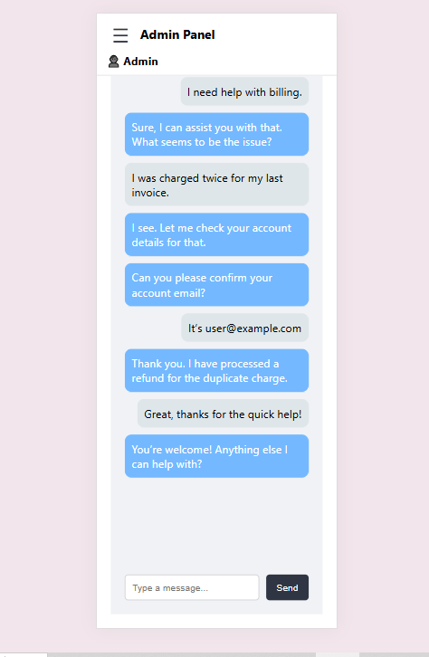

# BeyondChats - Admin Panel UI

## Project Description
BeyondChats is a responsive admin panel interface built using React. It features a collapsible sidebar, fixed header, and a chat window with dummy messages. The design is mobile-friendly, with smooth transitions and animations to enhance user experience.

## Features
- Responsive sidebar with toggle (hamburger) button
- Fixed header showing admin profile and panel title
- Chat window with dummy messages for UI demonstration
- Mobile responsiveness with adaptive layout
- Smooth transitions for sidebar open/close
- Clean and intuitive user interface

## Tech Stack
- React.js
- CSS Modules
- JavaScript (ES6+)

## Installation & Setup
To run this project locally, follow these steps:

```bash
git clone https://github.com/ShwetaAgarwa/BeyondChats.git
cd Beyondchats
npm install
npm start
This will start the app on http://localhost:3000.
Folder Structure
/src
  /components
    - Header.js
    - Sidebar.js
    - ChatWindow.js
  /styles
    - Header.module.css
    - Sidebar.module.css
    - ChatWIndow.module.css
  - App.js
  - App.css
## Screenshots

### Desktop View


### Mobile View



Usage
Explain briefly how to use the app, for example:

Click the hamburger menu to toggle the sidebar

View dummy chat messages in the chat window

Resize the browser to see responsive behavior

Contributing
If you'd like to contribute, please fork the repo and submit a pull request.

Future Enhancements
Real-time chat functionality: Integrate WebSocket or Firebase to enable live chat between users.

User authentication: Add login/logout features with role-based access control for admins and users.

Dynamic data loading: Connect to a backend API to fetch real chat data and user information.

Dark mode: Provide a toggle to switch between light and dark themes for better user experience.

Notification system: Show real-time alerts for new messages or important updates.

Customizable sidebar: Allow users to add/remove sidebar items or rearrange menu options.

Improved accessibility: Enhance keyboard navigation and screen reader support.

Search & filtering: Add the ability to search messages and filter chats by user or date.

Emoji and file attachments: Enable sending emojis, images, and files in chat.

Animations and transitions: Further polish UI with subtle animations for smoother interactions.

